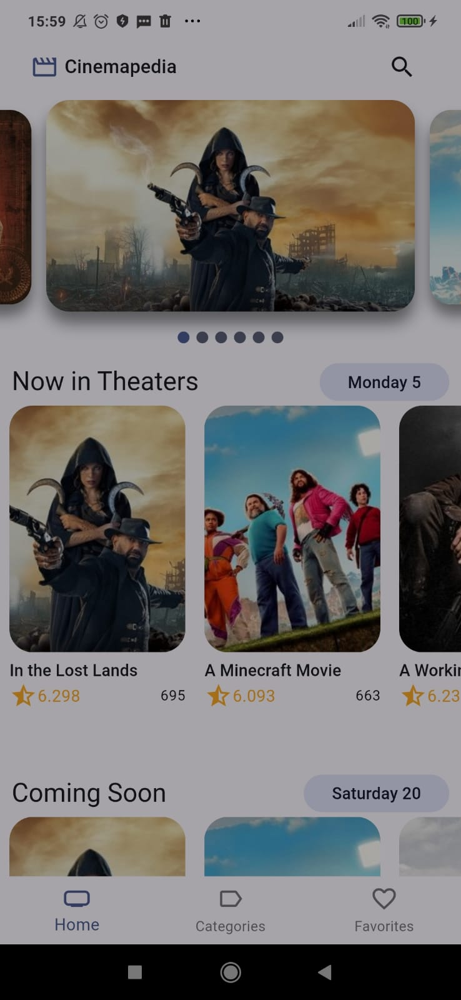

# 🎬 Cinemapedia

**Cinemapedia** é um aplicativo Flutter que permite aos usuários explorar filmes populares, em cartaz, próximos lançamentos e muito mais. Utilizando a API do [The Movie Database (TMDB)](https://www.themoviedb.org/), o aplicativo oferece uma experiência rica e interativa para os amantes do cinema.

---

## 🧱 Arquitetura Limpa (Clean Architecture)

Este projeto segue os princípios da **Clean Architecture**, promovendo uma separação clara de responsabilidades e facilitando a escalabilidade e manutenção do código.

* **Camada de Apresentação (Presentation):** Contém os widgets do Flutter e gerencia o estado da interface do usuário.
* **Camada de Domínio (Domain):** Inclui as entidades e os casos de uso que representam as regras de negócio.
* **Camada de Dados (Data):** Responsável por obter os dados de fontes externas, como APIs e bancos de dados locais.

A estrutura do projeto é inspirada em boas práticas amplamente reconhecidas na comunidade Flutter.

---

## 🚀 Funcionalidades

* **Listagem de filmes populares, em cartaz e próximos lançamentos.**
* **Detalhes completos de cada filme**, incluindo sinopse, elenco e avaliações.
* **Busca de filmes por título.**
* **Favoritar filmes para acesso rápido.**
* **Suporte a temas claro e escuro.**

---

## 🛠️ Tecnologias Utilizadas

* **Flutter:** Framework para desenvolvimento multiplataforma.
* **Riverpod:** Gerenciamento de estado reativo.
* **Dio:** Cliente HTTP para Dart.
* **Isar:** Banco de dados NoSQL local para Flutter.
* **GoRouter:** Gerenciamento de rotas declarativas.
* **Flutter SVG:** Renderização de arquivos SVG.
* **Google Fonts:** Integração com fontes do Google Fonts.

---

## 📸 Capturas de Tela

[As capturas de tela do projeto estão disponíveis no repositório]

---

## ⚙️ Como Executar

1. **Clone o repositório**: Para começar, clone o repositório do projeto e entre na pasta do projeto com o seguinte comando:

```bash
git clone https://github.com/Fabricio-Guima/cinemapedia.git
cd cinemapedia
```

2. **Obtenha uma API Key do TMDB**:
   * Crie uma conta no [The Movie Database](https://www.themoviedb.org/)
   * Acesse a seção de API e solicite uma chave de API

3. **Configure as variáveis de ambiente**:
   * Crie um arquivo `.env` na raiz do projeto
   * Adicione sua chave de API no formato:

```
THE_MOVIEDB_KEY=sua_chave_aqui
```

4. **Instale as dependências**:

```bash
flutter pub get
```

5. **Execute o aplicativo**:

```bash
flutter run
```

6. **Para construir a aplicação para produção**:

```bash
flutter build apk --release  # Para Android
flutter build ios            # Para iOS
```

## 📝 Requisitos

* Flutter 3.10.0 ou superior
* Dart 3.0.0 ou superior
* Uma chave de API válida do TMDB

## 📸 Capturas de Tela



## 📄 Licença

Este projeto está licenciado sob a licença MIT.
